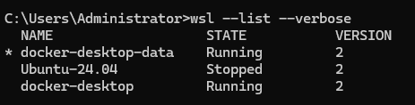
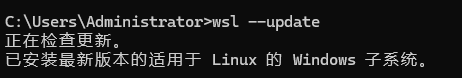
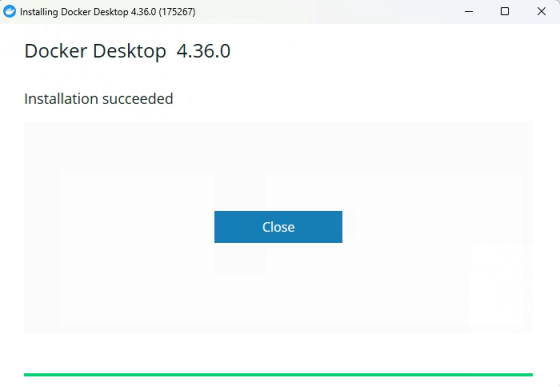
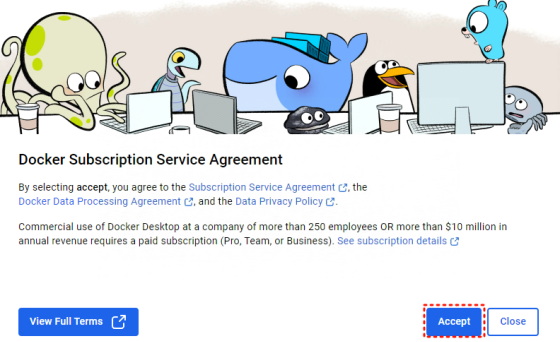
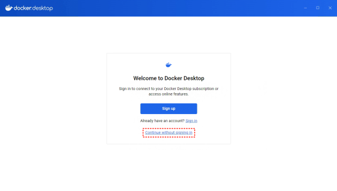
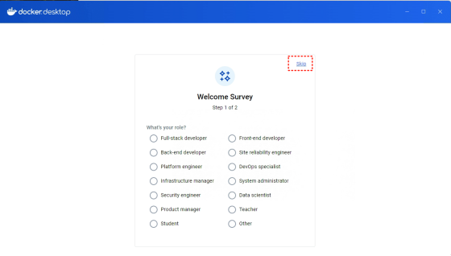
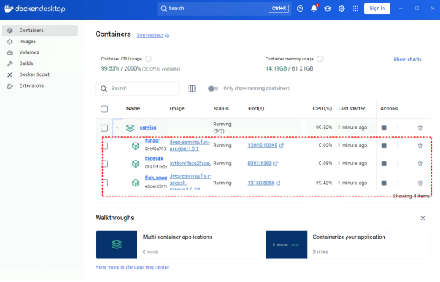

# Heygem   
这是一款专为Windows系统设计的全离线视频合成工具，它能够精确克隆您的外貌和声音，   
让您的形象数字化。您可以通过文字和语音驱动虚拟形象，进行视频制作。无需联网，保护   
隐私的同时，也能享受到便捷和高效的数字体验。   

## 安装指南   
一、前置条件   
1、必须有D盘   
2、C盘空闲空间大于100G，如果不足100G，可以在安装完成docker后，在下图的位置重   
新选一个剩余空间大于 100G 的磁盘文件夹 如下图：  

<div style="width: 100%; text-align: left;">
  
</div>   

3、确保有英伟达显卡，并正确安装显卡驱动，[英伟达驱动下载地址](https://www.nvidia.cn/drivers/lookup)      

<div style="width: 100%; text-align: left;">
  
</div> 

二、安装Docker   
1、用wsl --list --verbose命令可以查看本机有没有安装过wsl，如下图就是已经安装   
过，无需再安装   
<div style="width: 100%; text-align: left;">
  
</div> 

注： 由于网络原因，可能失败，多试几次；记住安装时设置的用户名、密码       

```   
    wsl --install    
```   

2、更新wsl   

<div style="width: 100%; text-align: left;">
  
</div>    

```
    wsl --update   
```

3、[官网](https://www.docker.com) 下载Docker Windows版，根据机器 CPU 架构选择不同的安装包   

<div style="width: 100%; text-align: left;">
  
</div> 
    
4、安装，出现如下界面表示安装成功   

<div style="width: 100%; text-align: left;">
  
</div>    

5、运行docker, 首次运行接受协议和跳过登录，如下图  

<div style="width: 100%; text-align: left;">
  
</div> 

<div style="width: 100%; text-align: left;">
  
</div> 

<div style="width: 100%; text-align: left;">
  
</div> 


三、安装服务   
1、双击运行service/deploy.bat文件，出现一个黑框   
2、耐心等待一段时间（半小时左右），黑框消失，Dokcer中会新增三个服务，表示成功。   
3、注意：每次开机后需要手动打开 Docker 才可以正常使用。     

<div style="width: 100%; text-align: left;">
  
</div> 

四、安装软件   
1、双击安装 heygem-x.x.x-setup.exe   


