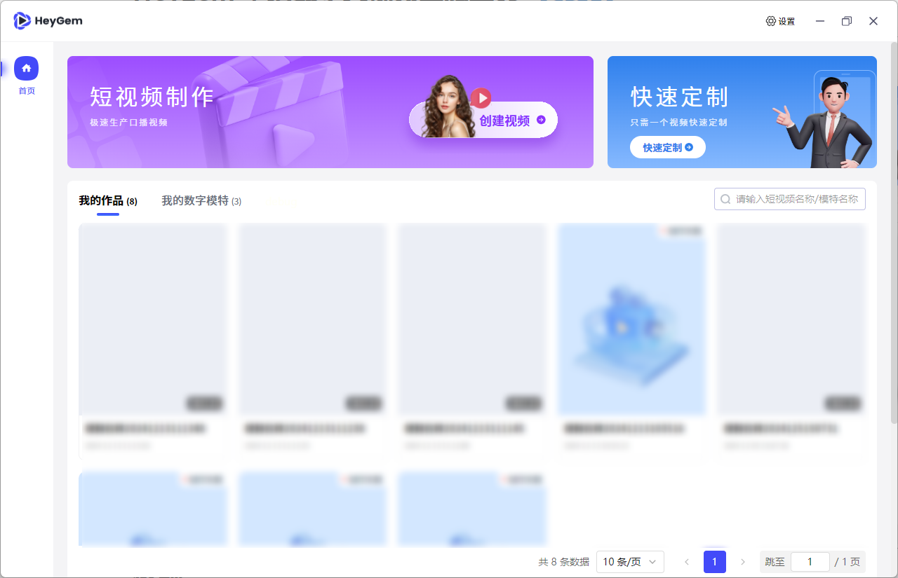
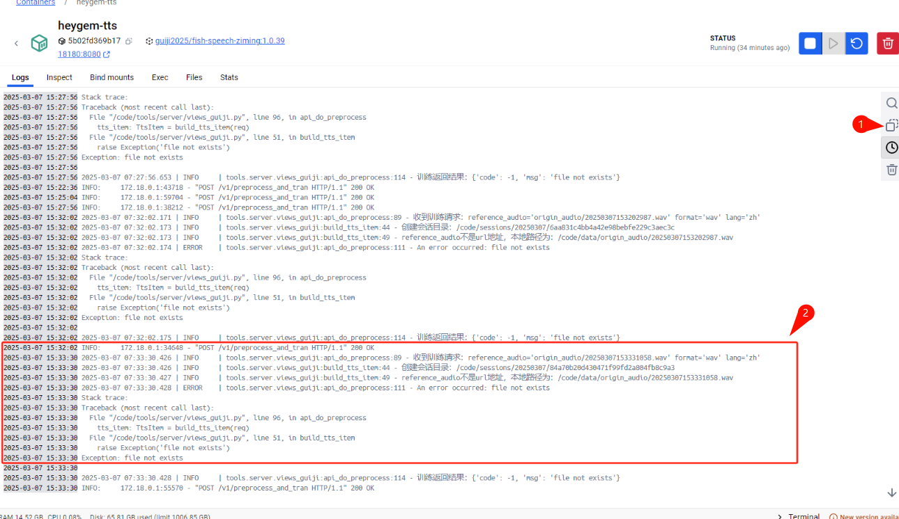

# Heygem - Open Source Alternative to Heygen [【中文】](./README_zh.md)



## Introduction

Heygem is a fully offline video synthesis tool designed for Windows systems that can precisely clone your appearance and voice, digitalizing your image. You can create videos by driving virtual avatars through text and voice. No internet connection is required, protecting your privacy while enjoying convenient and efficient digital experiences.

- Core Features
  - Precise Appearance and Voice Cloning: Using advanced AI algorithms to capture human facial features with high precision, including facial features, contours, etc., to build realistic virtual models. It can also precisely clone voices, capturing and reproducing subtle characteristics of human voices, supporting various voice parameter settings to create highly similar cloning effects.
  - Text and Voice-Driven Virtual Avatars: Understanding text content through natural language processing technology, converting text into natural and fluent speech to drive virtual avatars. Voice input can also be used directly, allowing virtual avatars to perform corresponding actions and facial expressions based on the rhythm and intonation of the voice, making the virtual avatar's performance more natural and vivid.
  - Efficient Video Synthesis: Highly synchronizing digital human video images with sound, achieving natural and smooth lip-syncing, intelligently optimizing audio-video synchronization effects.
  - Multi-language Support: Scripts support eight languages - English, Japanese, Korean, Chinese, French, German, Arabic, and Spanish.
- Key Advantages
  - Fully Offline Operation: No internet connection required, effectively protecting user privacy, allowing users to create in a secure, independent environment, avoiding potential data leaks during network transmission.
  - User-Friendly: Clean and intuitive interface, easy to use even for beginners with no technical background, quickly mastering the software's usage to start their digital human creation journey.
  - Multiple Model Support: Supports importing multiple models and managing them through one-click startup packages, making it convenient for users to choose suitable models based on different creative needs and application scenarios.
- Technical Support
  - Voice Cloning Technology: Using advanced technologies like artificial intelligence to generate similar or identical voices based on given voice samples, covering context, intonation, speed, and other aspects of speech.
  - Automatic Speech Recognition: Technology that converts human speech vocabulary content into computer-readable input (text format), enabling computers to "understand" human speech.
  - Computer Vision Technology: Used in video synthesis for visual processing, including facial recognition and lip movement analysis, ensuring virtual avatar lip movements match voice and text content.

## Dependencies

1. Nodejs 18
2. Docker Images
   - docker pull guiji2025/fun-asr:1.0.2
   - docker pull guiji2025/fish-speech-ziming:1.0.39
   - docker pull guiji2025/heygem.ai:0.0.7_sdk_slim

## Installation

### Prerequisites

1. Must have D Drive: Mainly used for storing digital human and project data
   - Free space requirement: More than 30GB
2. C Drive: Used for storing service image files

   - Free space requirement: More than 100GB
   - If less than 100GB is available, after installing Docker, you can choose a different disk folder with more than 100GB of remaining space at the location shown below.

     

3. System Requirements:
   - Currently supports Windows 10 19042.1526 or higher
4. Recommended Configuration:
   - CPU: 13th Gen Intel Core i5-13400F
   - Memory: 32GB
   - Graphics Card: RTX 4070
5. Ensure you have an NVIDIA graphics card with properly installed drivers

   NVIDIA driver download link: https://www.nvidia.cn/drivers/lookup/

   

### Installing Windows Docker

1. Use the command `wsl --list --verbose` to check if WSL is installed. If it shows as below, it's already installed and no further installation is needed.

   

> - WSL installation command: `wsl --install`
> - May fail due to network issues, try multiple times
> - During installation, you'll need to set and remember a new username and password

2. Update WSL using `wsl --update`.

   

3. [Download Docker for Windows](https://www.docker.com/), choose the appropriate installation package based on your CPU architecture.

4. When you see this interface, installation is successful.

   

5. Run Docker

   

6. Accept the agreement and skip login on first run

   

   

   

### Installing the Server

Installation using Docker, docker-compose as follows:

1. The `docker-compose.yml` file is in the `/deploy` directory.

2. Execute `docker-compose up -d` in the `/deploy` directory

3. Wait patiently (about half an hour, speed depends on network), download will consume about 70GB of traffic, make sure to use WiFi
4. When you see three services in Docker, it indicates success

   

### Client

1. Build script `npm run build:win`, after execution will generate `HeyGem-1.0.0-setup.exe` in the `dist` directory
2. Double-click `HeyGem-1.0.0-setup.exe` to install

## Open APIs

We have opened APIs for model training and video synthesis. After Docker starts, several ports will be exposed locally, accessible through `http://127.0.0.1`.

For specific code, refer to:

- src/main/service/model.js
- src/main/service/video.js
- src/main/service/voice.js

### Model Training

1. Separate video into silent video + audio
2. Place audio in `D:\heygem_data\voice\data`
   > `D:\heygem_data\voice\data` is agreed with the `guiji2025/fish-speech-ziming` service, can be modified in docker-compose
3. Call the `http://127.0.0.1:18180/v1/preprocess_and_tran` interface
   > Parameter example:
   >
   > ```json
   > {
   >   "format": ".wav",
   >   "reference_audio": "xxxxxx/xxxxx.wav",
   >   "lang": "zh"
   > }
   > ```
   >
   > Response example:
   >
   > ```json
   > {
   >   "asr_format_audio_url": "xxxx/x/xxx/xxx.wav",
   >   "reference_audio_text": "xxxxxxxxxxxx"
   > }
   > ```
   >
   > **Record the response results as they will be needed for subsequent audio synthesis**

### Audio Synthesis

Interface: `http://127.0.0.1:18180/v1/invoke`

```json
// Request parameters
{
  "speaker": "{uuid}", // A unique UUID
  "text": "xxxxxxxxxx", // Text content to synthesize
  "format": "wav", // Fixed parameter
  "topP": 0.7, // Fixed parameter
  "max_new_tokens": 1024, // Fixed parameter
  "chunk_length": 100, // Fixed parameter
  "repetition_penalty": 1.2, // Fixed parameter
  "temperature": 0.7, // Fixed parameter
  "need_asr": false, // Fixed parameter
  "streaming": false, // Fixed parameter
  "is_fixed_seed": 0, // Fixed parameter
  "is_norm": 0, // Fixed parameter
  "reference_audio": "{voice.asr_format_audio_url}", // Return value from previous "Model Training" step
  "reference_text": "{voice.reference_audio_text}" // Return value from previous "Model Training" step
}
```

### Video Synthesis

- Synthesis interface: `http://127.0.0.1:8383/easy/submit`

  ```json
  // Request parameters
  {
    "audio_url": "{audioPath}", // Audio path
    "video_url": "{videoPath}", // Video path
    "code": "{uuid}", // Unique key
    "chaofen": 0, // Fixed value
    "watermark_switch": 0, // Fixed value
    "pn": 1 // Fixed value
  }
  ```

- Progress query: `http://127.0.0.1:8383/easy/query?code=${taskCode}`
  > GET request, parameter `taskCode` is the return value from the above synthesis interface

## Self-Check Steps Before Asking Questions

1. Check if all three services are in Running status

   

2. Confirm that your machine has an NVIDIA graphics card and drivers are correctly installed.

   All computing power for this project is local. The three services won't start without an NVIDIA graphics card or proper drivers.

3. Ensure both server and client are updated to the latest version. The project is newly open-sourced, the community is very active, and updates are frequent. Your issue might have been resolved in a new version.

   - Server: Go to `/deploy` directory and re-execute `docker-compose up -d`
   - Client: `pull` code and re-`build`

4. [GitHub Issues](https://github.com/GuijiAI/HeyGem.ai/issues) are continuously updated, issues are being resolved and closed daily. Check frequently, your issue might already be resolved.

## Question Template

1. Problem Description

   Describe the reproduction steps in detail, with screenshots if possible.

2. Provide Error Logs

   - How to get client logs:

     

   - Server logs:

     Find the key location, or click on our three Docker services, and "Copy" as shown below.

     

## Contact Us

```
  end_sub@hotmail.com
```

## License

[LICENSE](./LICENSE)

## Acknowledgments

- ASR based on [fun-asr](https://github.com/modelscope/FunASR)
- TTS based on [fish-speech-ziming](https://github.com/fishaudio/fish-speech)
