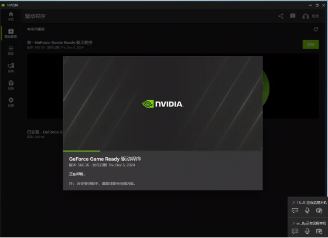

# Heygem - An open source, affordable alternative to Heygen [【中文】](./README_zh.md)


## Introduction

Heygem is a fully offline video synthesis tool designed for Windows systems that can precisely clone your appearance and voice, digitalizing your image. You can drive your virtual avatar through text and voice for video production. No internet connection is required, protecting your privacy while enjoying convenient and efficient digital experiences.

- Core Features
  - Precise Appearance and Voice Cloning: Using advanced AI algorithms to capture human facial features with high precision, including facial features, contours, etc., to build realistic virtual models. It can also precisely clone voices, capturing and reproducing subtle voice characteristics, supporting various voice parameter settings to create highly similar cloning effects.
  - Text and Voice-Driven Virtual Avatar: Understanding text content through natural language processing technology, converting text into natural and fluent speech to drive virtual avatars. Voice input can also be used directly, allowing virtual avatars to respond with corresponding actions and expressions based on voice rhythm and intonation, making the virtual avatar's performance more natural and vivid.
  - Efficient Video Synthesis: Highly synchronizes digital avatar's video and audio, achieving natural and smooth lip-syncing, intelligently optimizing audio-video synchronization effects.
  - Multi-language Support: Scripts support eight languages - English, Japanese, Korean, Chinese, French, German, Arabic, and Spanish.
- Key Advantages
  - Fully Offline Operation: No internet connection required, effectively protecting user privacy, allowing users to create in a secure, independent environment, avoiding potential data leaks during network transmission.
  - User-Friendly: Clean and intuitive interface, easy to use even for beginners with no technical background, quickly mastering the software's usage and easily starting digital avatar creation.
  - Multi-Model Support: Supports importing multiple models and managing them through one-click startup packages, making it convenient for users to choose suitable models based on different creative needs and application scenarios.
- Technical Support
  - Voice Cloning Technology: Using advanced technologies like artificial intelligence to generate similar or identical voices based on given voice samples, covering context, intonation, speed, and other aspects of speech.
  - Automatic Speech Recognition: Technology that converts human speech vocabulary content into computer-readable input (text format), enabling computers to "understand" human speech.
  - Computer Vision Technology: Used for visual processing in video synthesis, including facial recognition, lip movement analysis, etc., ensuring the virtual avatar's lip movements match the voice and text content.

## Dependencies

1. Nodejs 18
2. Docker Images
    - docker pull guiji2025/fun-asr:1.0.2
    - docker pull guiji2025/fish-speech-ziming:1.0.39
    - docker pull guiji2025/heygem.ai:0.0.7_sdk_slim

## Installation

### Prerequisites

1. Must have D Drive: Mainly used for storing digital avatar and project data
   - Free space requirement: More than 30GB
2. C Drive: Used for storing service image files
   - Free space requirement: More than 100GB
   - If less than 100GB is available, after installing Docker, you can select a folder on a disk with more than 100GB free space at the location shown below.
     
3. System Requirements:
   - Currently supports Windows 10 19042.1526 or higher
4. Recommended Configuration:
   - CPU: 13th Gen Intel Core i5-13400F
   - Memory: 32GB
   - Graphics Card: RTX-4070
5. Ensure you have an NVIDIA graphics card with properly installed drivers
   > NVIDIA driver download link: https://www.nvidia.cn/drivers/lookup/
   > 

### Installing Windows Docker

1. Use the command `wsl --list --verbose` to check if WSL is installed. The image below shows it's already installed, no need to reinstall.

   

   > - WSL installation command: `wsl --install`
   > - May fail due to network issues, try multiple times
   > - Need to set and remember a new username and password during installation

2. Update WSL using `wsl --update`

   

3. [Download Docker for Windows](https://www.docker.com/), choose the appropriate installation package for your CPU architecture.

4. This interface indicates successful installation:

   

5. Run Docker

   

6. Accept the agreement and skip login on first run

   

   

   

### Installing the Server

Install using Docker, docker-compose as follows:

1. The `docker-compose.yml` file is in the `/deploy` directory.

2. Execute `docker-compose up -d` in the `/deploy` directory

3. Wait patiently (about half an hour, depending on internet speed), download will consume about 70GB of traffic, make sure to use WiFi
4. When you see three services in Docker, it indicates success

   

### Client

1. Build script `npm run build:win`, after execution, `HeyGem-1.0.0-setup.exe` will be generated in the `dist` directory
2. Double-click `HeyGem-1.0.0-setup.exe` to install

## Open APIs

We provide APIs for model training and video synthesis. After Docker starts, several ports will be exposed locally, accessible through `http://127.0.0.1`.

For specific code, refer to:

- src/main/service/model.js
- src/main/service/video.js
- src/main/service/voice.js

### Model Training

1. Separate video into silent video + audio
2. Place audio in `D:\heygem_data\voice\data`
   > `D:\heygem_data\voice\data` is agreed with the `guiji2025/fish-speech-ziming` service, can be modified in docker-compose
3. Call the `http://127.0.0.1:18180/v1/preprocess_and_tran` interface
   > Parameter example:
   >
   > ```json
   > {
   >   "format": ".wav",
   >   "reference_audio": "xxxxxx/xxxxx.wav",
   >   "lang": "zh"
   > }
   > ```
   >
   > Response example:
   >
   > ```json
   > {
   >   "asr_format_audio_url": "xxxx/x/xxx/xxx.wav",
   >   "reference_audio_text": "xxxxxxxxxxxx"
   > }
   > ```
   >
   > **Record the response results for later audio synthesis use**

### Audio Synthesis

Interface: `http://127.0.0.1:18180/v1/invoke`

```json
  // Request parameters
  {
    "speaker": "{uuid}", // A unique UUID
    "text":"xxxxxxxxxx", // Text content to synthesize
    "format": "wav", // Fixed parameter
    "topP": 0.7, // Fixed parameter
    "max_new_tokens": 1024, // Fixed parameter
    "chunk_length": 100, // Fixed parameter
    "repetition_penalty": 1.2, // Fixed parameter
    "temperature": 0.7, // Fixed parameter
    "need_asr": false, // Fixed parameter
    "streaming": false, // Fixed parameter
    "is_fixed_seed": 0, // Fixed parameter
    "is_norm": 0, // Fixed parameter
    "reference_audio": "{voice.asr_format_audio_url}", // Return value from previous "Model Training" step
    "reference_text": "{voice.reference_audio_text}" // Return value from previous "Model Training" step
  }
```

### Video Synthesis

- Synthesis interface: `http://127.0.0.1:8383/easy/submit`

```json
// Request parameters
{
  "audio_url": "{audioPath}", // Audio path
  "video_url": "{videoPath}", // Video path
  "code": "{uuid}", // Unique key
  "chaofen": 0, // Fixed value
  "watermark_switch": 0, // Fixed value
  "pn": 1 // Fixed value
}
```

- Progress query: `http://127.0.0.1:8383/easy/query?code=${taskCode}`
  > GET request, parameter `taskCode` is the return value from the above synthesis interface

## Contact Us

```
  end_sub@hotmail.com
```

## License

[LICENSE](./LICENSE)

## Acknowledgments

- ASR based on [fun-asr](https://github.com/modelscope/FunASR)
- TTS based on [fish-speech-ziming](https://github.com/fishaudio/fish-speech)
